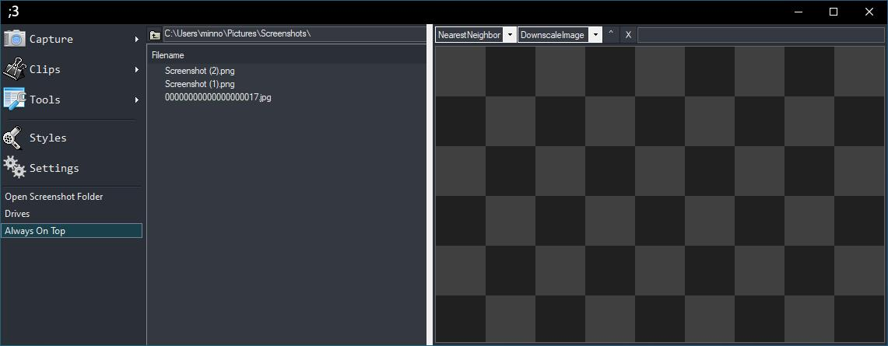

# Winking Cat Face

Screenshot software for cats

<!-- TABLE OF CONTENTS -->

  
Table of Contents

  <ol>
    <li>
      <a href="#about-the-project">About The Project</a>
    </li>
    <li>
      <a href="#features">Features</a>
      <ul>
        <li><a href="#clips">Clips</a></li>
        <li><a href="#color-picker">Color Picker</a></li>
        <li><a href="#hotkeys">Hotkeys</a></li>
        <li><a href="#image-viewer">Image Viewer</a></li>
        <li><a href="#image-support">Image Support</a></li>
        <li><a href="#ocr">OCR</a></li>
      </ul>
    </li>
    <li><a href="#dependencies">Dependencies</a></li>
  </ol>

## About The Project

This project is a screenshot utility for Windows. I was unsatisfied with the other options available, most of them lacking the ability to have the screenshot quickly persist onscreen. With the <a href="#clips">Clips</a> feature, this is super easy.

 

## Features

TWCF has a large featureset.

It's primary purpose is taking screenshots but it can also act as a color picker, read and create QRCodes/Barcodes, perform OCR, act as a file manager, check file hashes, and do regex.

### Clips

One of the most popular features is **Clips**.

A clip is a screenshot which remains on screen and can be dragged around, resized, rotated and copied.

The default hotkey to make a new clip is `Alt + Z`.

  
Clip Showcase:

### Color Picker

TWCF has a powerful built-in color picker.

The color picker supports conversions between 4 different color spaces, can visualize 3 of them, has hex and decimal input and output and can pick colors directly from your screen.

  
Color Picker Preview:

### Hotkeys

  
You can set custom hotkeys for the following functionality:

| Name  | Description |
|---------|---------|
| None                             | do nothing     |
| Region Capture                   | select an area to screenshot |
| New Clip From Region Capture     | createa a clip from a selected area |
| New Clip From File               | createa a clip from a selected file |
| New Clip From Clipboard          | createa a clip from an image in your clipboard |
| Screen Color Picker              | choose a color on your screen to copy it |
| Capture Last Region              | capture last selected region |
| Capture Fullscreen               | capture all monitors |
| Capture Active Monitor           | capture the monitor with your mouse on it |
| Capture Active Window            | capture the active window |
| Capture Window                   | do nothing |
| Capture gif                      | do nothing |
| New OCR Capture                  | do nothing |
| Color Wheel Picker               | opens a new color picker window |
| Hash Check                       | opens a new hash check window  |
| Regex                            | opens a new regex window  |
| QRCode                           | opens a new QRCode window  |
| Open Main Form                   | opens the main window |

  
Hotkey Window Preview:

### Image Viewer

The main window acts a file explorer with a builtin image viewing window. You can set some different interpolation modes and drag modes allowing you to zoom and move the image around. There is also a fullscreen button.

By default the file explorer is pointed to your set screenshots folder, so if you ever need to quicly see something you just took a screenshot of, it's right there waiting.

### Image Support

| Format  | Reading | Writing | Notes              |
|---------|---------|---------|--------------------|
| JPEG    | yes     | yes     | none               |
| PNG     | yes     | yes     | none               |
| BMP     | yes     | yes     | none               |
| TIFF    | yes     | yes     | none               |
| GIF     | yes     | yes     | no feature for writing animated gifs |
| WEBP    | yes     | yes     | requires libwebp plugin, no animation support |
| WRM     | yes     | yes     | this is a custom image format which only this application supports |

### OCR

You can run OCR on images using [OCR.Space](https://ocr.space/)'s online API.

This OCR service works relatively well and has a bunch of supported languages.

  
OCR Window Preview:

 

## Dependencies

- [Newtonsoft.Json](https://github.com/JamesNK/Newtonsoft.Json)

- [ZXing.Net](https://github.com/micjahn/ZXing.Net)

- [Windows-API-Code-Pack](https://github.com/contre/Windows-API-Code-Pack-1.1)

